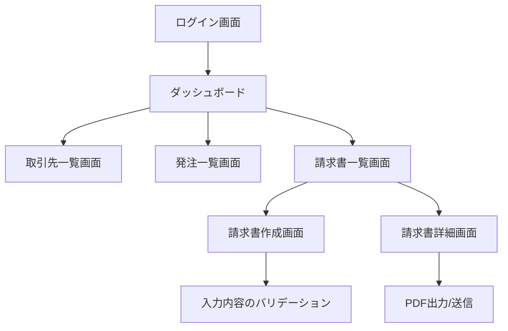

### 1. システム概要

- システム名: OPUS (Outsourcing Process Unification System)
- 概要: 業務委託先(取引先)情報管理、受発注管理、(主に外部から受領する)請求書管理などを行うWebアプリケーション。
- 対象ユーザ: 経理担当、購買担当など社内スタッフ。
  - 今回の主たる利用者は「外部フリーランサーや取引先法人から請求書を受け取り、支払管理を行う小規模法人の担当者」。
  - ただし、取引先(フリーランサーや法人)がOPUSへログインし、請求書を直接作成/発行できる機能も用意し、請求書の一元管理を目指す。

### 2. 機能要件

#### 2.1 ユーザー管理

- (FR-1) ログイン/ログアウト機能
  - ユーザー(社内スタッフ・外部ユーザー問わず)はメールアドレスとパスワードでログインできる。
- (FR-2) パスワードリセット機能
  - パスワードを忘れたユーザーが自身のメールアドレスにリセット用リンクを送信できる。
- (FR-3) ユーザー権限管理機能
  - 一般ユーザー → 請求書の承認ができない等、ロールによる機能制限が存在する。
  - 外部ユーザー(フリーランサーなど) → OPUS内で請求書を作成し、必要に応じて提出できる。

#### 2.2 取引先管理

- (FR-4) 取引先情報の登録/編集/削除
  - 会社名、メールアドレス、登録番号、住所などが対象。
- (FR-5) 取引先の検索/フィルタリング
  - 取引先名や登録番号を検索キーにフィルタリングできる。
- (FR-6) タグ管理
  - 特定の取引先にタグをつけて分類したり、一覧でフィルタリングを行える。

#### 2.3 受発注管理

- (FR-7) 発注書の作成
  - 取引先選択、品目一覧、数量、単価などを入力。
- (FR-8) 受注確認・進捗管理
  - 発注書のステータス管理(作成中/発注済み/納品済み など)。
- (FR-9) 大量データへの対応
  - 50件、100件単位で連続して品目を追加するケースのパフォーマンスを検証。

#### 2.4 請求書管理

- (FR-10) 請求書の作成 (法人内/外部ユーザー両対応)
  - 通常はフリーランサーなど外部側が請求書を用意するケースが多いが、本システム内で外部ユーザーが直接ログインし、請求書を作成・提出できるようサポートする。
    - インボイス制度にも対応（登録番号や税率の取り扱い）。
    - 社内側が代理で作成するニーズがある場合にも対応する。
- (FR-11) 請求書の送信/印刷/ダウンロード
  - 上記のFR-10で作成した請求書をPDFとして出力、またはOPUS上で承認した後に取引先へ送るなど。
  - 外部ユーザーが作成した請求書も、同じくPDF出力・ダウンロードが可能。
- (FR-12) 請求書のステータス管理
  - 請求書が下書き、承認待ち、承認済み、支払済み、却下 などに応じてステータス変更。
  - ロールによって「承認権限がある/ない」を制御。
- (FR-13) バリデーション
  - 登録番号フォーマットチェック (「T＋13桁」か?)
  - 数量や単価など数値項目の範囲チェック
- (FR-14) 外部請求書の受領・登録
  - 外部ユーザーがOPUS上で請求書を発行せず、別途PDF等で送ってきた場合でも、手動もしくは自動(将来的なOCR/解析)でOPUSに登録可能。
  - 請求書の支払ステータスや入金予定日を管理し、支払後は「支払済み」フラグを付与できる。

### 3. 非機能要件

- (NFR-1) パフォーマンス
  - 主要ページは2秒以内に読み込まれること。
  - テーブル表示はページネーション対応で大量データにも耐えられる。
- (NFR-2) セキュリティ
  - HTTPS通信必須
  - XSS/CSRF対策
  - 権限のないユーザーが管理者機能にアクセスできないこと
- (NFR-3) 可用性
  - 平日9:00~18:00 は安定稼働することが望ましい（例）
- (NFR-4) ログ
  - 主要なCRUD操作は監査ログに記録されることが望ましい

### 4. 画面要件

- ログイン画面
  - 入力項目: メールアドレス、パスワード
  - ボタン: ログイン、パスワードリセットへリンク
- ダッシュボード
  - 取引先/発注/請求書などのサマリを表示
- 取引先一覧画面
  - 管理テーブル+「新規登録」「タグでフィルタ」などの操作
- 発注一覧/請求書一覧
  - テーブル表示 + ページネーション + 並び替え
- その他、詳細ページや編集画面 など

### 5. データ要件

- 取引先 (Vendor)
  - 必須項目: name, registrationNumber など
  - 任意項目: tag, email, phoneNumber, address など
- 請求書 (Invoice)
  - 必須項目: invoiceNumber, vendorId, issueDate, dueDate, など
  - 明細行 (items): itemName, quantity, unitPrice, taxRate など
  - 「送信元(フリーランサー)」「受領日」「支払期限」なども(外部受領(FR-14))時に必要。
  - ユーザーID(発行した外部ユーザーを特定するために利用)を持たせてもよい。
- ユーザー (User)
  - 必須項目: email, password, role など
  - 外部ユーザー用ロール(例えば "freelancer", "vendor" など)を設定すれば、請求書作成ページへのアクセスを制御可能。

### 6. 運用要件

- ログの保管期間
- データバックアップの頻度
- 運用担当者ごとの権限設定（例: 一般ユーザー、管理者など）

### 7. フローチャート図

以下は、OPUSの主要なユーザ操作フローを示すフローチャートです。  
この図を参照することで、各画面間の遷移や主要な機能連携の概要が理解しやすくなります。

---

### 8. テストとの関連 (Cypressへの補足)

> ※ 本ドキュメントは機能要件をまとめたものだが、MVPリリースを迅速化するため、E2EテストはCypressを用いて実施する予定。必要に応じてテストケースや各種フローについては [test-guide.md](./test-guide.md) を参照。
>
> - 本システムの要件としては上記FRに加えて、主要な操作フロー（ログイン、取引先管理、請求書作成・承認など）をCypressでカバーする。
> - 大量データを扱う部分(NFR-1, FR-9)に関してはCypressのパフォーマンステスト機能は限定的なため、必要なら別途stress test/負荷検証ツールを使うことを検討する。

---
